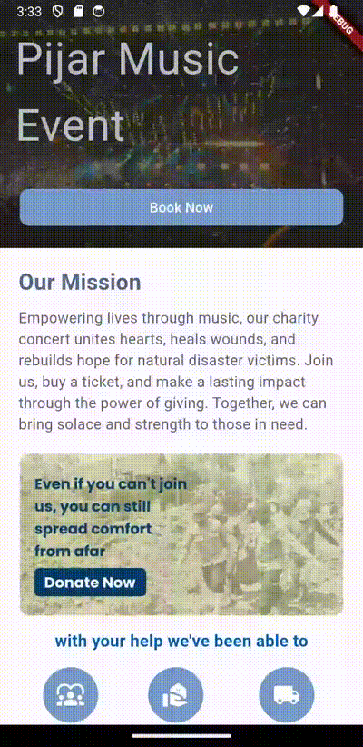
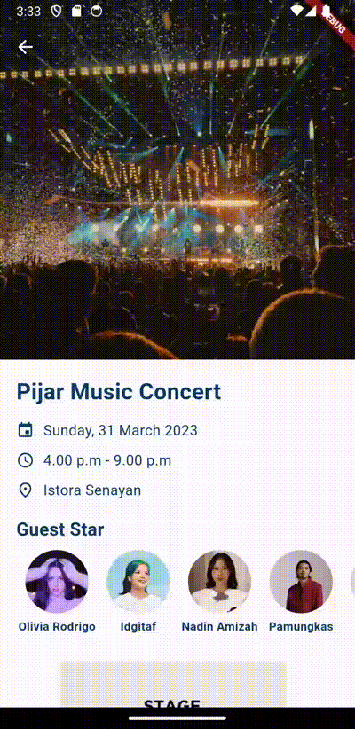
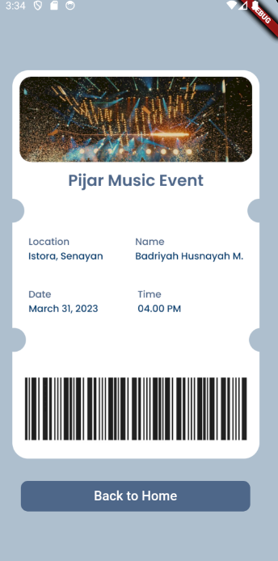

# Tugas 3

### Charity Concert Ticket App

This app, created as part of a college assignment for the Pemrograman Berbasis Mobile course, is a straightforward charity concert ticketing application. It employs stateless widgets to provide a simple and efficient user experience. Users can browse through available concerts, book tickets, and view their ticket details seamlessly. 

## Screenshots

| Homepage                                           | Booking Page                                          | Ticket Page                                           |
|----------------------------------------------------|-------------------------------------------------------|-------------------------------------------------------|
|          |     |    |

## Getting Started

This project is a starting point for a Flutter application. Follow the steps below to get started:

### Prerequisites

Before you begin, ensure you have Flutter installed. For installation instructions, refer to the [Flutter documentation](https://flutter.dev/docs/get-started/install).

### Installation

1. Clone this repository to your local machine:
git clone https://github.com/badriyahhm/PBM-Projects/tree/main/Tugas3

2. Navigate to the project directory:
cd Tugas3
3. Install dependencies: flutter pub get

## Resources

If this is your first Flutter project, consider checking out the following resources to get started:

- [Lab: Write your first Flutter app](https://flutter.dev/docs/get-started/codelab)
- [Cookbook: Useful Flutter samples](https://flutter.dev/docs/cookbook)

For more detailed guidance on Flutter development, refer to the [online documentation](https://flutter.dev/docs/), which offers tutorials, samples, and a full API reference.

## Contributions

Contributions to this project are welcome. If you find any issues or have suggestions for improvements, please feel free to submit a pull request or open an issue on GitHub.
